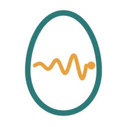
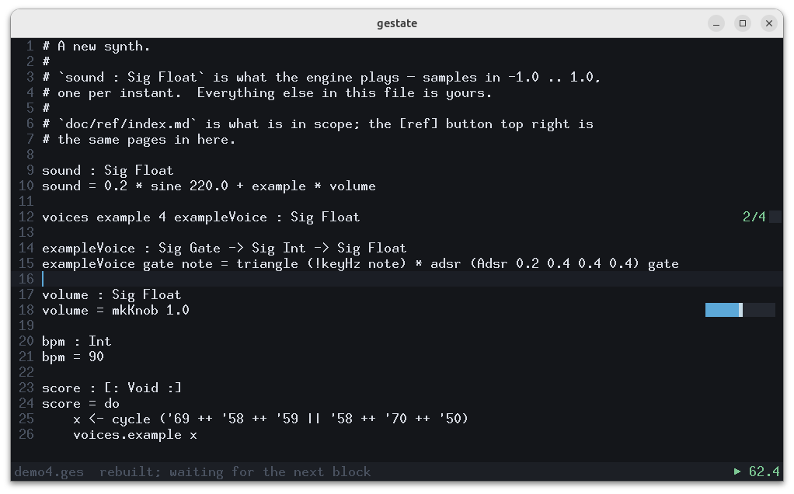
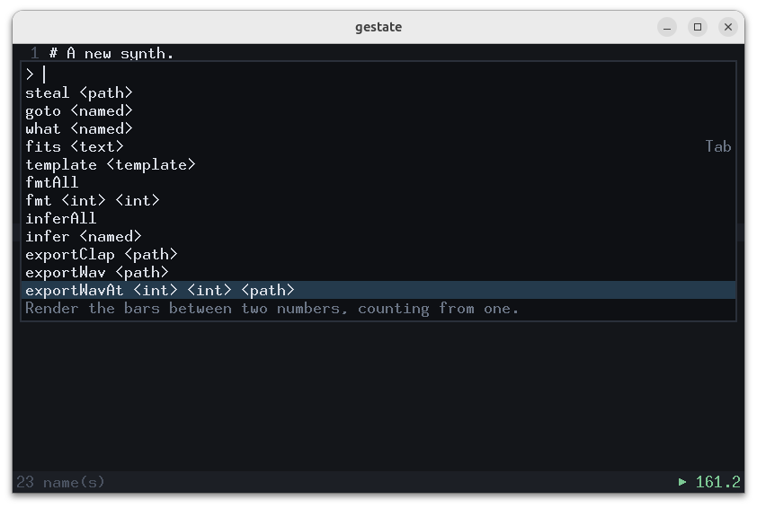
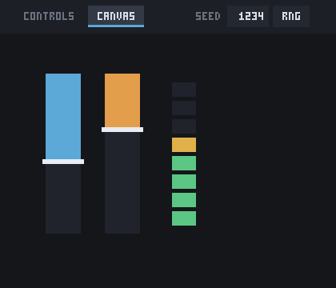

<p align="center">
  
</p>

<h1 align="center">gestate</h1>

<p align="center"><em>A language for programs that develop while they are already alive.</em></p>

Gestate is a small functional language for sound, music and moving
pictures.  A program is a handful of signal declarations; the compiler
checks them into a **static graph** — fixed memory, bounded work per
sample, no allocation after the first instant — and runs it native
through LLVM.  Because the graph is exactly what the source says, an
edit while the program plays **migrates the running state**: the
oscillator keeps its phase and the filter its memory while the sound
changes under your hands.  That is the logo, and the name.

```
env : Sig Float
env = perc 6.0 (gateOn (!(x => x < 0.5) (phase 2.0)))

sound : Sig Float
sound = 0.4 * sine 220.0 * env
```

`!` lifts an ordinary function over signals; everything else is
functions and values.  Scores, polyphonic voice banks, MIDI in, a tape
echo you can gate, and a canvas the same program draws on are all
library and language, documented down to the measured decibel.

## Hear it

```sh
python -m gestate.audioperform examples/super/dubgate.ges      # play it
python -m gestate.audioperform examples/super/dubgate.ges -o dub.wav --seconds 16
python -m pytest                                            # the suite
```

Try `examples/audio/violin.ges` for a concert soloist lost in a sound
system, or anything under `examples/beginner/` beside its lesson.

## Edit it while it sounds

```sh
python -m gestate.workbench examples/super/dubgate.ges
```

The workbench is the editor, and it is the room the language was built
for: the file, its knobs drawn **beside their own declarations**, a
piano, and the sound — all at once.  `Ctrl-S` applies an edit without
stopping the note that is ringing, because the graph is exactly what the
source says and the running state migrates across the change.

<p align="center">
  
</p>

Two things in that picture are facts the text cannot state. The slider
on line 18 is `volume`'s own channel, at `volume`'s own line — not a
panel you read against the code. And `2/4` beside the bank is how many
of its voices are sounding **now**: `voices example 4` is already in the
source, so a window that only repeated it would be decoration.

There is **one mode, and it is typing**.  `Ctrl-K` opens the command
list, which is every other thing the editor can do, filterable, each with
its name and its key; a capability cannot exist without appearing there,
because the list is derived from `gestate/command.ges` the way the
reference is derived from the libraries.  A build that fails leaves the
sound playing and puts the compiler's complaint beside the line that
caused it.

<p align="center">
  
</p>

That list is not a menu the window maintains — it is
`gestate/command.ges` read back, so what you see is the vocabulary
itself: the argument types are what let it ask (`<int>`, `<path>`,
`<named>`), the key is the one the command publishes, and the sentence
under the selection is the declaration's own doc comment.  Adding a
capability is adding a declaration, and there is nowhere else to put one.

Two commands are the language answering about itself.  **`Tab`** asks
what fits — give it a type and it lists everything in scope that could
stand there, from inference over the text in the window rather than the
last save.  **`template`** pastes one of the language's ideas at the
cursor — a knob, a voice bank, a metronome, a tape echo, a canvas, a
piece — with its documentation left behind in the list where you read it
to choose.

## Play it

A gestate file exports as a **CLAP plugin** — one native graph, its
knobs as automatable parameters, its voice banks fed by MIDI, and its
score performed against the DAW's transport.

```sh
python -m gestate.export examples/audio/lantern.ges -o ~/.clap/lantern.clap --gui
```

<p align="center">
  
</p>

That is `examples/audio/lantern.ges` — one file, three halves: a score
that unfolds, a synth that is compiled, and a canvas that is
interpreted.

The window has two sides and one painter.  **CONTROLS** is the
descriptor — faders, a note-routing matrix, a switch per bank for who
plays it.  **CANVAS** is the program's own picture: a file that declares
a `substrate : Sig Sub` draws it here, interpreted at frame rate.  The
blue fader above *is* the filter's cutoff — not a copy of it, the same
declaration — so dragging it moves the sound, and the DAW sees an
ordinary parameter change it can undo and automate.  The ladder beside
them is the instrument's own loudness, arriving from the audio thread.

**SEED** is the take.  A chancy piece — `lantern` draws a figure every
bar, `nightdrive` picks a road every four — is a family of performances,
and the seed says which one you are hearing.  Roll it, or type one in
and keep it: it is a plugin parameter, so the session remembers it, the
DAW can automate it, and writing the number down is enough to get the
night back.  A piece whose score is a decided list of events has no
entropy to reroll and is offered no seed.

`spec/panel.md` and `spec/substrate.md` are the design; the whole face
is software-rendered from a display list the language already speaks, so
there is no toolkit in the build.

## Read it

* **[The beginner course](doc/beginner.md)** — ten lessons from a sine
  to a piece; `doc/intermediate.md`, `doc/advanced.md` and
  `doc/super.md` continue it.
* **[The manual](doc/manual.md)** — the language, plainly.
* **[The reference](doc/ref/index.md)** — every name in every library,
  generated from the sources so it cannot drift.
* **[The specs](spec/)** — how each part is designed and why, costs
  stated; `journal.md` is the honest running account, `fixme.md` the
  defect ledger.

The logo: an egg, and inside it a signal growing to full amplitude —
carried to term while already sounding.
