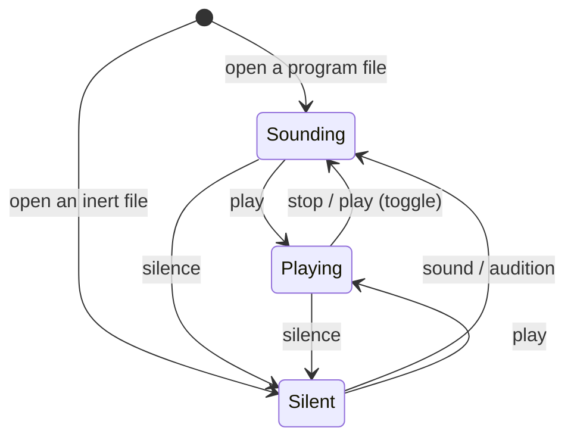

# The transport's three modes — a model written before its code

*2026-09-07.  The trial `card:gui-is-difficult.md` Q5 asked for and
`card:transport-modes.md` Q4 is: the model said in four languages,
checked, before `Transport` is touched.  Henri: "Yes, try the model
languages on the transport card first.  One problem is that it's not
an isolated case.  But maybe that's ok."*

**What is held to what.**  The type below and `gestate/transportmode.py`
spell one model two ways, and `test/test_transport_model.py` refuses
the run when their constructor names differ, and checks every
invariant here over every mode and verb.  The invariants are stated
in Alloy's discipline and checked by enumeration rather than by
Alloy: the tool is not installed here and is not wanted, and for a
machine of three states and five verbs the enumeration *is* the
bounded check.

## 1. Sentences — the model said in prose first

Object-Role Modeling's discipline: a fact is a sentence a musician
could read and refuse.

1. The workbench is in exactly one **mode**: *silent*, *sounding* or
   *playing*.
2. The **engine** is up or down.  The **sound card** is held or free.
   The **clock** moves or is held.
3. The mode decides all three.  *Silent*: engine down, card free,
   clock held.  *Sounding*: engine up, card held, clock held.
   *Playing*: engine up, card held, clock moving.
4. Each mode has a verb that lands there: `silence` → silent, `sound`
   → sounding, `play` → playing.  `stop` lands in *sounding* from
   *playing*, and does nothing in *silent* — there is nothing to stop.
5. `play` from *silent* brings the engine up and plays: one word, two
   changes, because a person pressing play wants to hear.
6. The **position** is a number.  It changes only when the clock moves
   or when `seek` says so; `seek` is allowed in every mode.
7. A **loop** is a pair of positions or none.  Setting one is allowed
   in every mode; it acts only while the clock moves.
8. A file that is **inert** is *silent* and stays so under every verb.

**Not isolated, as he said — the neighbours this model names and
does not own:**

- **The keyboard** is audible when the engine is up *and* `performing`
  is not `off`.  `performing` (off / on / step) is a second axis —
  where the keyboard's notes *go* — and stays its own switch.  So
  *sounding* with `performing off` is silent to the hands, which is
  the status line's to say, not the mode's.
- **A rebuild** (`apply`, `audition`) needs an engine to swap.  In
  *silent*, `apply` saves and compiles and swaps nothing; `audition`
  is a request to hear, so it lands in *sounding* first.  *Session's
  default, his to strike.*
- **The engine's lifecycle** (`Live.start`, the lifecycle `stop`) is
  what *silent* ↔ *sounding* drives; today it runs once, on open and
  on close.
- **The C host** and the Python transport are two faces of one clock;
  the mode is read by whichever fills the block.

## 2. The type — in the tree's own spelling

    Mode := Silent | Sounding | Playing

    engineUp  : Mode -> Bool      -- Silent -> False, else True
    cardHeld  : Mode -> Bool      -- the same function, on purpose
    clockMoves: Mode -> Bool      -- Playing -> True, else False

    Verb := Play | Stop | Sound | Silence | Seek

    step : Mode -> Verb -> Mode

`gestate/transportmode.py` is this in Python, with `step` written
out.  Illegal states are unrepresentable: there is no value for
*card held, engine down*, because the card is a function of the mode.

## 3. The invariants — Alloy's discipline, run as an enumeration

| | invariant | held by |
|---|---|---|
| I1 | the card is never held in *silent* | `facts` is a function of the mode |
| I2 | the clock never moves outside *playing* | same |
| I3 | the engine is up exactly when the card is held | same |
| I4 | every verb from every mode lands in a mode — `step` is total | enumeration |
| I5 | an inert file is *silent* under every verb | enumeration |
| I6 | every mode is reachable from the open state, *sounding* | breadth-first over verbs |
| I7 | `stop` never brings the engine up | enumeration |
| I8 | `seek` never changes the mode | enumeration |

Thirty steps in all — three modes, five verbs, inert or not — and
the test walks every one.

## 4. The statechart

Every state also has a self-loop on `seek`, `loop`, `apply`.  `play`
from *playing* is the toggle the command already documents — *start
the transport, or stop it if it is running* — so it lands in
*sounding*.

## 5. What the trial found — the questions the model forced

Writing the sentences forced five decisions that the two-state
transport never had to make, and none of them was visible in the
card's `because`:

1. Where `stop` lands from *silent* (nothing; sentence 4).
2. Whether `play` from *silent* is one word or two (one; sentence 5).
3. What `audition` means with no engine (a request to hear; it brings
   the engine up).
4. That the keyboard's audibility is a *conjunction* of two axes, and
   the mode owns only one of them.
5. That `inert` is a mode fixed by the file, not a fourth mode.

Each is a session's default and marked so.  **What the languages
cost:** one sitting, and one module of forty lines that the
implementation will read instead of a boolean.  **What they did not
do:** say whether *sounding* is the right name; a model checks
consistency, not taste.

## 6. How it lands in the code, when Henri says

`Transport.playing: bool` becomes `mode: Mode` read by `fill`;
`Workbench.play/pause/toggle` call `step`; two verbs, `sound` and
`silence`, join `command.ges`, and `silence` runs the lifecycle stop
without closing the window.  The status line says the mode by name.
