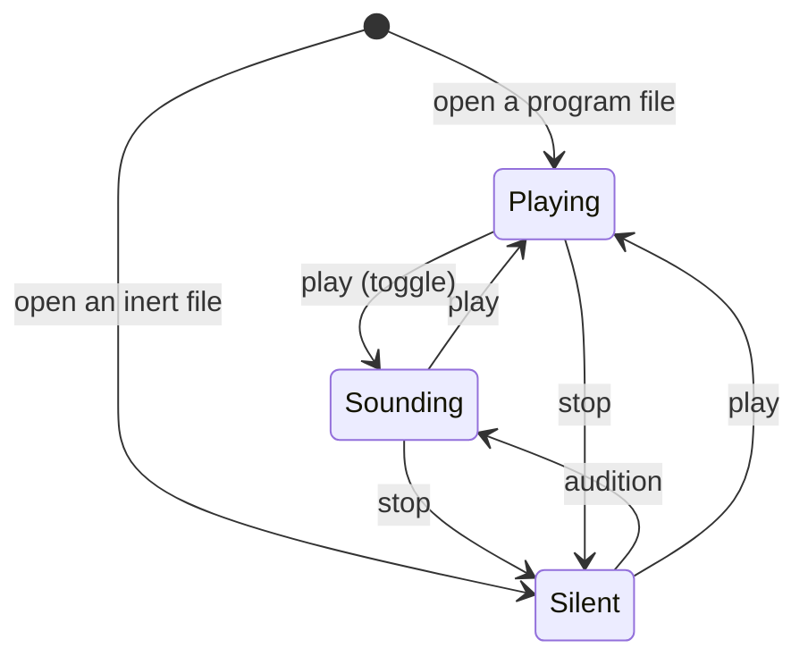

# The transport's three states — a model written before its code

*Called* modes *until 2026-09-07, afternoon.  Henri: "rename them to
states, modes is the wrong word" — `vision.md` §"What gestate won't be": gestate won't grow modes, and typing is the one mode.  The card
keeps its filename, since a card's name is its id.*

*2026-09-07.  The trial `card:gui-is-difficult.md` Q5 asked for and
`card:transport-modes.md` Q4 is: the model said in four languages,
checked, before `Transport` is touched.  Henri: "Yes, try the model
languages on the transport card first.  One problem is that it's not
an isolated case.  But maybe that's ok."*

**What is held to what.**  The type below and `gestate/transportstate.py`
spell one model two ways, and `test/test_transport_model.py` refuses
the run when their constructor names differ, and checks every
invariant here over every state and verb.  The invariants are stated
in Alloy's discipline and checked by enumeration rather than by
Alloy: the tool is not installed here and is not wanted, and for a
machine of three states and five verbs the enumeration *is* the
bounded check.

## 1. Sentences — the model said in prose first

Object-Role Modeling's discipline: a fact is a sentence a musician
could read and refuse.

1. The workbench is in exactly one **state**: *silent*, *sounding* or
   *playing*.
2. The **engine** is up or down.  The **sound card** is held or free.
   The **clock** moves or is held.
3. The state decides all three.  *Silent*: engine down, card free,
   clock held.  *Sounding*: engine up, card held, clock held.
   *Playing*: engine up, card held, clock moving.
4. Each state has a verb that lands there, and they are the verbs the
   window already has: `stop` → silent, `play` → playing, `audition`
   → sounding.  **Henri, 2026-09-07:** *"'stop' goes to silence,
   'play' goes to playing, 'audition' goes to 'sounding'."*  So `stop`
   brings the engine down and frees the card, from anywhere.
5. `play` from *silent* brings the engine up and plays: one word, two
   changes, because a person pressing play wants to hear.  `play`
   from *playing* is the toggle `command.ges` documents and lands in
   *sounding* — the score stops, the instrument stays up, which is how
   a moved note is heard with the score stopped.  `audition` from
   *playing* keeps playing: it is a rebuild, and today's audition
   while playing does not stop the score.  *Session's defaults, the
   two things his sentence did not say.*
6. The **position** is a number.  It changes only when the clock moves
   or when `seek` says so; `seek` is allowed in every state.
7. A **loop** is a pair of positions or none.  Setting one is allowed
   in every state; it acts only while the clock moves.
8. A file that is **inert** is *silent* and stays so under every verb.

**Not isolated, as he said — the neighbours this model names and
does not own:**

- **The keyboard** is audible when the engine is up *and* `performing`
  is not `off`.  `performing` (off / on / step) is a second axis —
  where the keyboard's notes *go* — and stays its own switch.  So
  *sounding* with `performing off` is silent to the hands, which is
  the status line's to say, not the state's.
- **A rebuild** (`apply`, `audition`) needs an engine to swap.  In
  *silent*, `apply` saves and compiles and swaps nothing; `audition`
  is a request to hear, so it lands in *sounding* first.  *Session's
  default, his to strike.*
- **The engine's lifecycle** (`Live.start`, the lifecycle `stop`) is
  what *silent* ↔ *sounding* drives; today it runs once, on open and
  on close.
- **The C host** and the Python transport are two faces of one clock;
  the state is read by whichever fills the block.

## 2. The type — in the tree's own spelling, and since the evening a chart

    Awake := Sounding | Playing
    State := Silent Int | Up Awake
    Verb  := Play | Stop Int | Audition | Seek Int
    Do    := Sound | Hush | SeekTo Int | AllOff

    step  : State -> Verb -> Step State Do
    enter : State -> List Do

**This is `gestate/transport.ges`**, the first chart `chart.ges` runs
(`card:gui-is-difficult.md` §"The first slice").  The afternoon's
flat `State := Silent | Sounding | Playing` is the three words the bar
speaks, kept as the Python enum in `gestate/transportstate.py`, whose
`step` now asks the chart.  Hierarchy is the nesting — one `stop`
arrow leaves `Up _` — and history is the payload: `Silent` carries the
parked position, so the event that leaves it carries none.  Illegal
states are still unrepresentable: the card is a function of the state,
and *card held, engine down* has no value to be written in.

## 3. The invariants — Alloy's discipline, run as an enumeration

| | invariant | held by |
|---|---|---|
| I1 | the card is never held in *silent* | `facts` is a function of the state |
| I2 | the clock never moves outside *playing* | same |
| I3 | the engine is up exactly when the card is held | same |
| I4 | every verb from every state lands in a state — `step` is total | enumeration |
| I5 | an inert file is *silent* under every verb | enumeration |
| I6 | every state is reachable from the open state, *playing* | breadth-first over verbs |
| I7 | `stop` never brings the engine up | enumeration |
| I8 | `seek` never changes the state | enumeration |
| I9 | `stop` lands in *silent* from every state — the card is free after it | enumeration |
| I10 | `audition` never lands in *silent* — it is a request to hear | enumeration |

Thirty steps in all — three states, five verbs, inert or not — and
the test walks every one.

## 4. The statechart

Every state also has a self-loop on `seek`, `loop`, `apply`, and
*playing* on `audition`.  **The bar shows all three** — Henri:
*"'sounding' should show as some state of its own in the bar"* — so
the furniture's `playing` boolean becomes the state on the wire
(`shell/editor/src/furniture.rs`).

## 5. What the trial found — the questions the model forced

Writing the sentences forced five decisions that the two-state
transport never had to make, and none of them was visible in the
card's `because`:

1. Where `stop` lands.  *Session's first default: sounding.*
   **Henri: silent** — `stop` is the word that frees the card, and
   the score stops with `play`'s toggle.
2. Whether `play` from *silent* is one word or two (one; sentence 5).
3. What `audition` means with no engine.  **Henri: it lands in
   sounding** — a request to hear.
4. That the keyboard's audibility is a *conjunction* of two axes, and
   the state owns only one of them.
5. That `inert` is a state fixed by the file, not a fourth state.

Henri, 2026-09-07, on the set: *"I think these are good choices"*,
with 1 and 3 fixed as above; the rest stand as the session's
defaults.  **What the languages
cost:** one sitting, and one module of forty lines that the
implementation will read instead of a boolean.  **What they did not
do:** say whether *sounding* is the right name; a model checks
consistency, not taste.

## 6. How it landed — 2026-09-07, the same day

`Transport` and `HostTransport` gained `advancing` and `clock`: while
*sounding* a block is still rendered and the engine's clock runs, and
the score's `position` is held — in C, `held` in `gestate/host.c`,
with `gestate_host_position` answering the held one and
`gestate_host_clock` the engine's own; resuming is a seek to the held
position.  A note is stamped against the engine's clock in both
drivers, which is what keeps a key pressed while sounding from
arriving with its attack already spent.  `Workbench.state`,
`set_mode`, `sound` and `stop(keep=True)` are the transitions;
`play`, `pause` and `toggle` go through them.  `do_play`, `do_stop`
and `do_audition` run `step`; the furniture line carries the state by
name and `view.rs` draws ▶, ‖ and ■.  No verb joined `command.ges`;
three doc lines changed.  Photographed on the virtual display,
`test/driven/20260907-143215-transport-modes/`: ▶, ‖ and ■ in the bar,
each with its word in the status line.  **A correction to §4 while
landing**: a
program file opens *playing*, as it always has, not *sounding* — the
session had misread the card's Q2.

**And by the evening, executable.**  `gestate/chart.ges` is the library
— `Step`, `Chart`, `initial`, `advance`, `beside`, `Or` — and
`gestate/transport.ges` the chart; `gestate/charts.py` compiles the
two once (0.2 s) and applies `advance transport` per event (twenty
microseconds); `Workbench.transition` executes the `Do`s it answers
with — `Sound`, `Hush`, `SeekTo`, `AllOff` — and settles the
transport's flags for the state arrived in.  `set_state`, `play`,
`pause` and `toggle` are verbs now.  Every test that held the Python
step holds the chart, and three more hold the arrows the Python never
had: the entry action, the parked position on the event, and two
charts `beside` each other sharing nothing.

### How it was to land — as written before

`Transport.playing: bool` becomes `state: State` read by `fill`;
`Workbench.play/pause/toggle` call `step`; no verb joins
`command.ges`, since `stop`, `play` and `audition` are the three
already there — `stop` runs the lifecycle stop without closing the
window, and `audition` from *silent* starts the engine before it
rebuilds.  The furniture carries the state instead of a boolean, and
the bar shows *sounding* as its own state.
